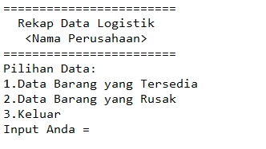
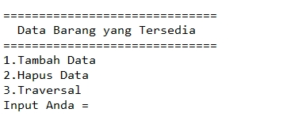
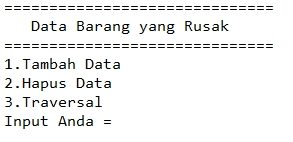
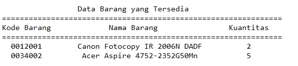

# JUDUL_PROYEK
Rekapan Data Logistik Perusahaan

Anggota Kelompok:
* ZHILLAN THAFHAN AHDA (140810200018)
* FIKRI ARKANI SALIM (140810200050)
* ZAHRAN HANIF FATHANMUBIN (140810200062)
---
## Latar Belakang
Dalam menjalankan Perusahaan kebutuhan logistik merupakan hal yang berperan dalam memaksimalkan performa dari perusahaan.  Dengan adanya rekapan logistik pada perusahaan diharapkan barang-barang yang ada di perusahaan dapat terorganisir.

## Tujuan dan Manfaat
Mempermudah pendataan barang-barang yang tersedia, dan rusak pada suatu perusahaan.

## Penjelasan Aplikasi
Program yang digunakan untuk mendata barang-barang yang tersedia pada perusahaan menggunakan struktur data linked list. Mendata barang-barang yang rusak pada suatu perusahaan menggunakan struktur data query priority.

## Gambar Rancangan Antar Muka
Main Menu

Sub Menu 1

Sub Menu 2

After Sub Menu

## Rencana Pengerjaan Projek
Untuk pengerjaannya kami akan menggunakan berbagai platform sosial media untuk mendiskusikan projek ini. Aplikasi seperti Line, Zoom, Google Meet, dan Discord akan kami gunakan untuk saling berdiskusi. Untuk pengerjaan makalah kami akan menggunakan Google Docs. Untuk pengerjaan projeknya kami akan menggunakan VS Code. 

## Lisensi

MIT License 2021
